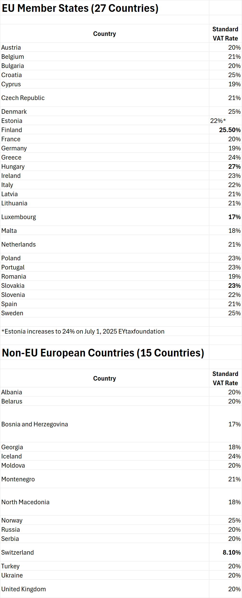

EU Member States (27 Countries)
CountryStandard VAT RateAustria20%Belgium21%Bulgaria20%Croatia25%Cyprus19%Czech Republic21%Denmark25%Estonia22%*Finland25.5%France20%Germany19%Greece24%Hungary27%Ireland23%Italy22%Latvia21%Lithuania21%Luxembourg17%Malta18%Netherlands21%Poland23%Portugal23%Romania19%Slovakia23%Slovenia22%Spain21%Sweden25%
*Estonia increases to 24% on July 1, 2025 EYtaxfoundation
Non-EU European Countries (15 Countries)
CountryStandard VAT RateAlbania20%Belarus20%Bosnia and Herzegovina17%Georgia18%Iceland24%Moldova20%Montenegro21%North Macedonia18%Norway25%Russia20%Serbia20%Switzerland8.1%Turkey20%Ukraine20%United Kingdom20%

